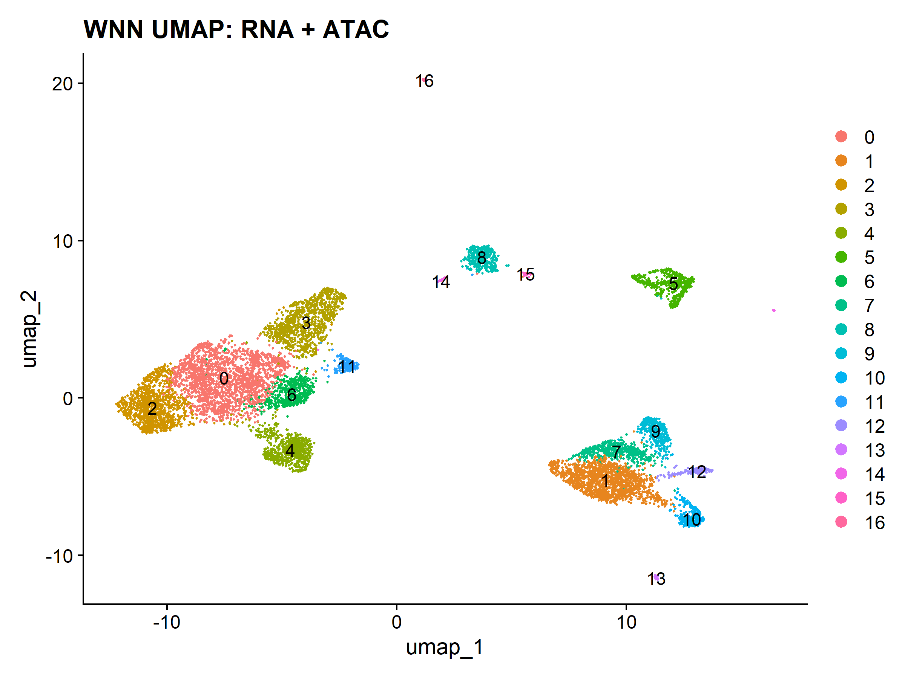
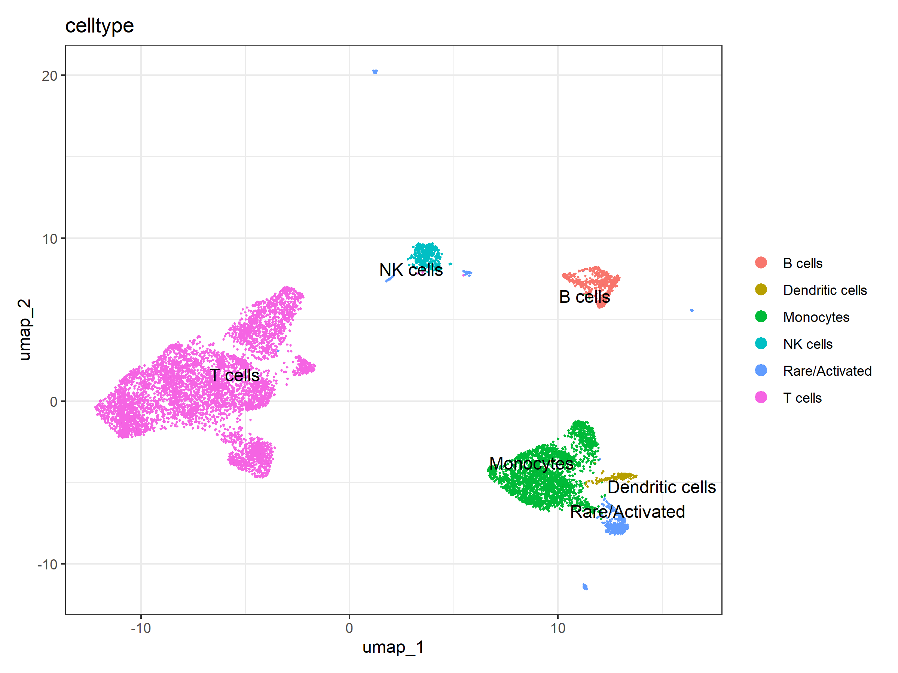
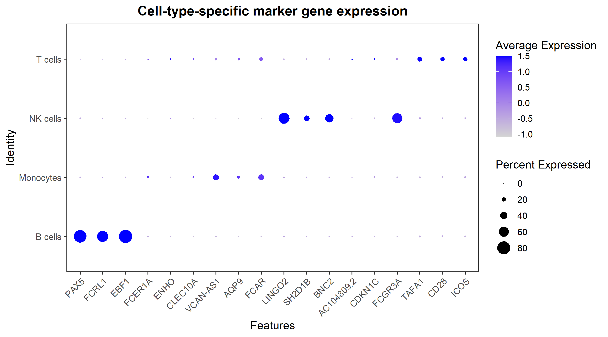
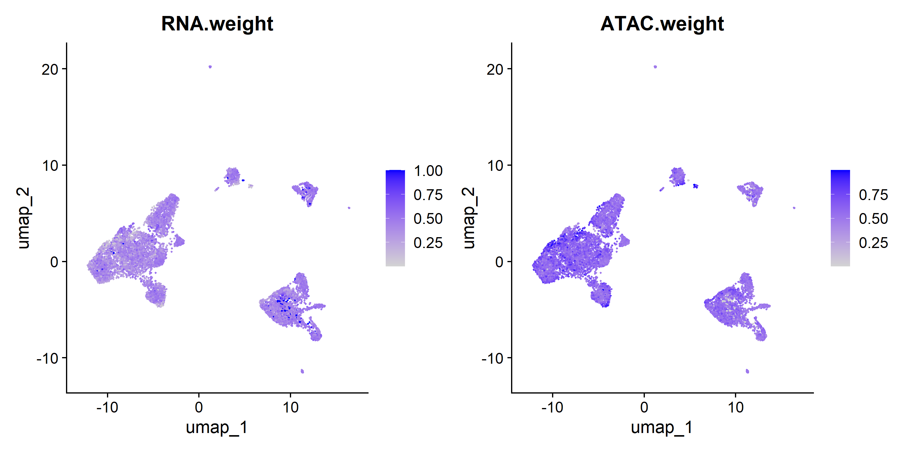

Single-cell Multiome (RNA + ATAC) Integration using WNN
Overview

This project presents an integrated analysis of single-cell RNA sequencing (scRNA-seq) and chromatin accessibility (scATAC-seq) data from human peripheral blood mononuclear cells (PBMCs). Using the Weighted Nearest Neighbor (WNN) framework implemented in Seurat and Signac, transcriptomic and epigenomic modalities were combined to improve cell type identification and biological interpretation.

The goal of this project is to demonstrate a reproducible, end-to-end bioinformatics workflow for multi-omics single-cell data analysis, reflecting current best practices used in modern computational biology research.

Methods
The analysis pipeline includes the following steps:

Data acquisition
Publicly available 10x Genomics PBMC multiome dataset (RNA + ATAC)

Preprocessing and Quality Control
Filtering low-quality cells based on RNA and ATAC metrics
Mitochondrial content filtering
ATAC-specific QC (TSS enrichment, nucleosome signal)

Multi-modal Integration
Normalization of RNA and ATAC assays
Dimensionality reduction (PCA for RNA, LSI for ATAC)
Weighted Nearest Neighbor (WNN) integration

Clustering and Visualization
Graph-based clustering
UMAP visualization of integrated data

Cell Type Annotation
Manual annotation based on canonical marker genes

Differential Expression Analysis
Marker detection using MAST
Identification of cell-type-specific gene signatures

Visualization
UMAP plots
Marker gene dot plots
Heatmaps for validation

Results
WNN UMAP Clustering
Integrated analysis reveals distinct immune cell populations with improved separation compared to single-modality approaches.

Cell Type Annotation
Major immune cell types identified include:
T cells
B cells
Natural Killer (NK) cells
Monocytes
Dendritic cells

Marker Gene Expression
Cell identities were validated using canonical marker genes:
T cells: CD28, ICOS
B cells: MS4A1, PAX5
NK cells: GNLY, NKG7
Monocytes: LYZ, VCAN

Biological Insights
Multi-omics integration improves resolution of immune cell populations
Chromatin accessibility information complements transcriptomic signals
Distinct lineage-specific gene expression patterns validate clustering results
The WNN framework effectively captures modality-specific contributions across cells
### Modality Contributions (WNN)

The WNN framework captures the relative contribution of RNA and ATAC modalities across cells.

Tools and Technologies
R
Seurat
Signac
MAST
ggplot2 / patchwork
Bioconductor packages

Project Structure
scripts/      # Analysis pipeline scripts
figures/      # Final visualizations
results/      # Output tables (e.g., marker genes)

Reproducibility
The analysis can be reproduced by running the scripts in order:

source("scripts/01_download_data.R")
source("scripts/02_create_object.R")
source("scripts/03_qc_filter.R")
source("scripts/04_wnn_analysis.R")
source("scripts/06_annotation.R")
source("scripts/07_differential_expression.R")

Session information and package versions are provided in:

session_info.txt
Data Source
10x Genomics PBMC Multiome dataset
https://www.10xgenomics.com/
Key Contributions
Implementation of a multi-omics integration pipeline
Demonstration of WNN-based analysis
Reproducible workflow aligned with current bioinformatics standards
Clear biological interpretation of single-cell data
Author

[Muhamamd Laiq]
[(https://github.com/2016n3184-rgb)]
